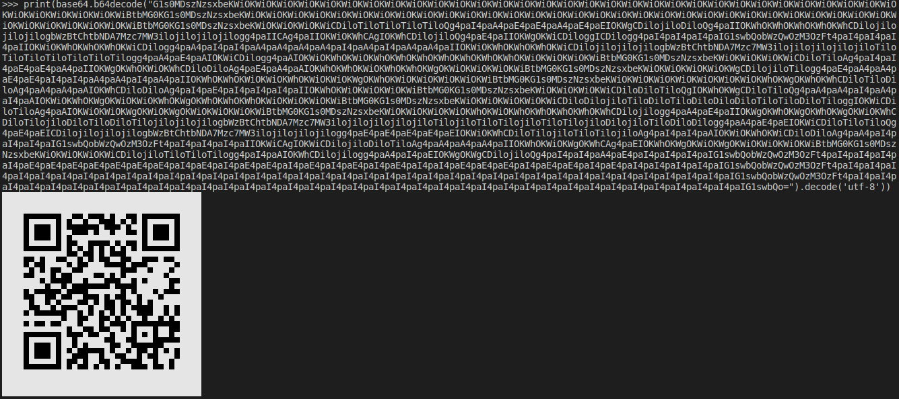

# read-qrs

I this challenge we are given a server which returns a base64-encoded string. This string decodes to ascii-art that looks like a qr code. 

To make my code able to decode the qr quickly, I thought it would be smart to generate a png from the ascii-art and then decode the picture. Each row in the ascii-art equals 2 rows of pixels. Since qr-codes consists of black and white pixels, we have 4 different sets of bytes to represent the pixels. \xe2\x96\x88 makes both pixels white, \xe2\x96\x80 makes top pixel black and bottom pixel white, \xe2\x96\x84 makes top pixel white and bottom pixel black, while a simple space makes both pixels black. 

Additionally, the ascii art is 37*37 pixels. 

Programmaticaly this could look like this:

<pre><code>count += 1
    baits = base64.b64decode(qrb64)
    row = 0
    column = 0

    for i,bait in enumerate(baits):
        if baits[i] in b"\x1b[40;37;1m":
            continue
            
        if baits[i:i+3] == b"\xe2\x96\x88":
            pixels[row][column] = 1
            if row < 36:
                pixels[row+1][column] = 1
            column += 1
            
        elif baits[i] == 32:
            pixels[row][column] = 0
            if row < 36:
                pixels[row+1][column] = 0
            column += 1
            
        elif baits[i:i+3] == b"\xe2\x96\x84":
            pixels[row][column] = 0
            if row < 36:
                pixels[row+1][column] = 1
            column += 1
            
        elif baits[i:i+3] == b"\xe2\x96\x80":
            pixels[row][column] = 1
            if row < 36:
                pixels[row+1][column] = 0
            column += 1
            
        if column == 37:
            column = 0
            row += 2
</code></pre>

When I'm done putting this data into a 2d-list, I created an image with Image from PIL with this code:

<pre><code>
for y in range(h):
    for x in range(w):
        char = pixels[y][x]
        if char == 0:
            img.putpixel((x, y), (0, 0, 0))  # Place a black pixel for 0's
        else:
            img.putpixel((x, y), (255, 255, 255))  # Place a white pixel for 1's
            
img.save('./qr.png')
img.close
</code></pre>

Lastly, I had to decode the qr-code. For this, I used decode() from pyzbar.pyzbar.

<pre><code>
decoded = decode(Image.open("./qr.png"))
print(decoded)
decoded = decoded[0].data.decode()
</code></pre>

Lastly I had to do this over again a few times until the flag was received. The whole code looks like this:

<pre><code>
#!/usr/bin/env python3
from pwn import *
import base64
from PIL import Image
from pyzbar.pyzbar import decode

HOST="35.242.226.178"
PORT=30819

pixels = [[0 for j in range(37)]for i in range(37)] #0 er sort, 1 er hvit
for i in range(37):
    pixels[36][i] = 1

r = remote(HOST,PORT)
qrb64 = r.recvuntil(b"Did you read that?\r\n").replace(b"b'",b"").split(b"'\r\n")[0]
count = 0
while True:
    count += 1
    baits = base64.b64decode(qrb64)
    row = 0
    column = 0

    for i,bait in enumerate(baits):
        if baits[i] in b"\x1b[40;37;1m":
            continue
            
        if baits[i:i+3] == b"\xe2\x96\x88":
            pixels[row][column] = 1
            if row < 36:
                pixels[row+1][column] = 1
            column += 1
            
        elif baits[i] == 32:
            pixels[row][column] = 0
            if row < 36:
                pixels[row+1][column] = 0
            column += 1
            
        elif baits[i:i+3] == b"\xe2\x96\x84":
            pixels[row][column] = 0
            if row < 36:
                pixels[row+1][column] = 1
            column += 1
            
        elif baits[i:i+3] == b"\xe2\x96\x80":
            pixels[row][column] = 1
            if row < 36:
                pixels[row+1][column] = 0
            column += 1
            
        if column == 37:
            column = 0
            row += 2
            
    h = 37
    w = 37
    img = Image.new('RGB', (h, w))
    y = 0
    x = 0

    for y in range(h):
        for x in range(w):
            char = pixels[y][x]
            if char == 0:
                img.putpixel((x, y), (0, 0, 0))  # Place a black pixel for 0's
            else:
                img.putpixel((x, y), (255, 255, 255))  # Place a white pixel for 1's
                
    img.save('./qr.png')
    img.close

    decoded = decode(Image.open("./qr.png"))
    print(decoded)
    decoded = decoded[0].data.decode()

    r.sendline(decoded)
    if count < 5:
        rec = r.recvuntil(b"Did you read that?\r\n")
        print(rec)
        qrb64 = rec.replace(b"b'",b"").split(b"'\r\n")[0]
    else:
        print(r.recv())
        break
</code></pre>

The code could definetly look a lot cleaner, but it worked, so I had to move on to other challenges. 

Thanks for a great CTF with different challenging and fun challenges!
MrFreddi007 - RITJ